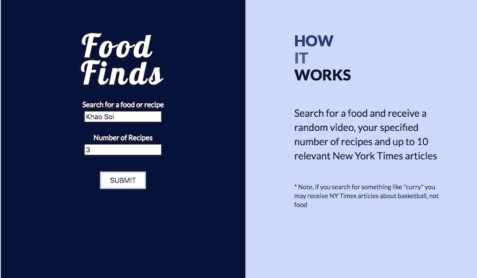

# recipe-finder
App that lets users search for a food and receive recipes, articles and a video 

## View Live
https://keeleyduffey.github.io/recipe-finder/

Search Input + Description

Results

## Summary  
Food Finds allows users to search for a food or recipe and receive a specified number of recipes, up to 10 New York Times articles and a random YouTube video related to the food.

## Technologies Used 
* HTML5 / CSS / JavaScript / jQuery
* Edamam API
* New York Times API
* YouTube API
